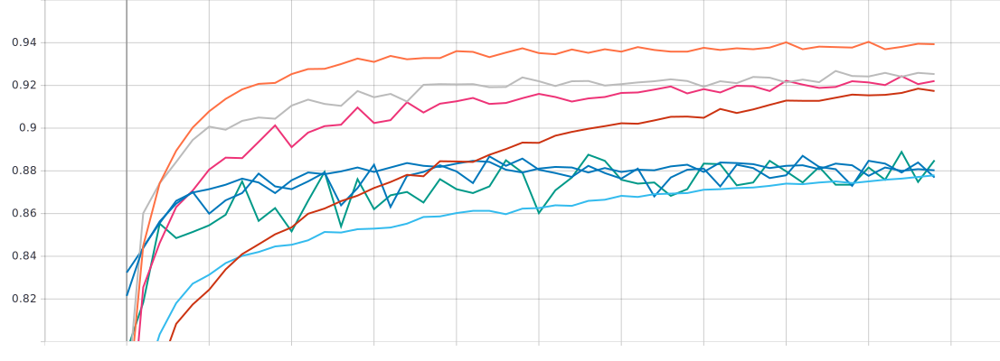
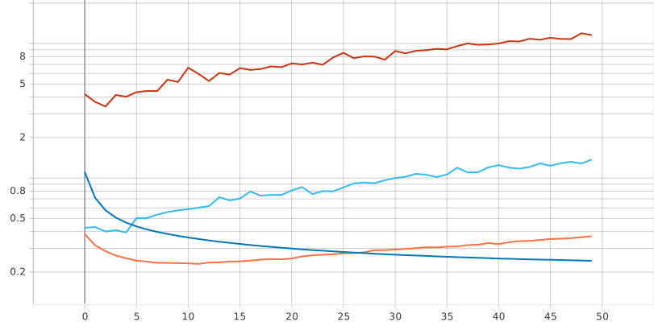
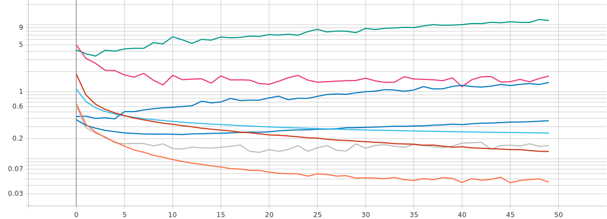
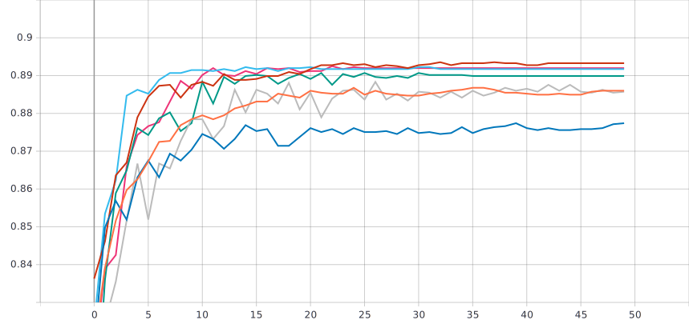
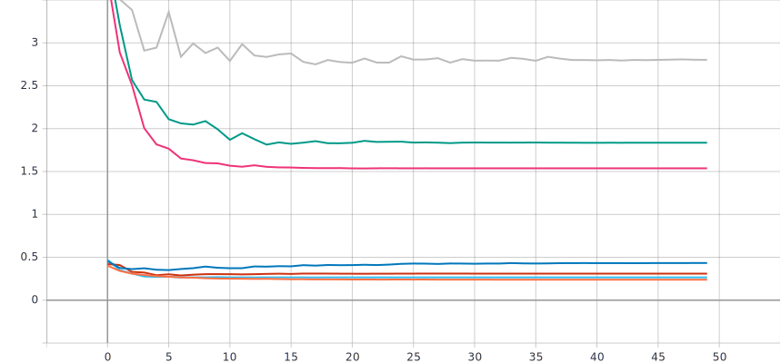
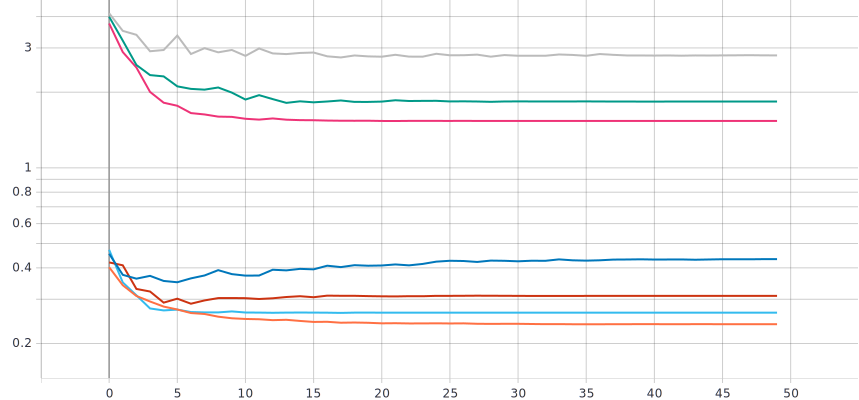
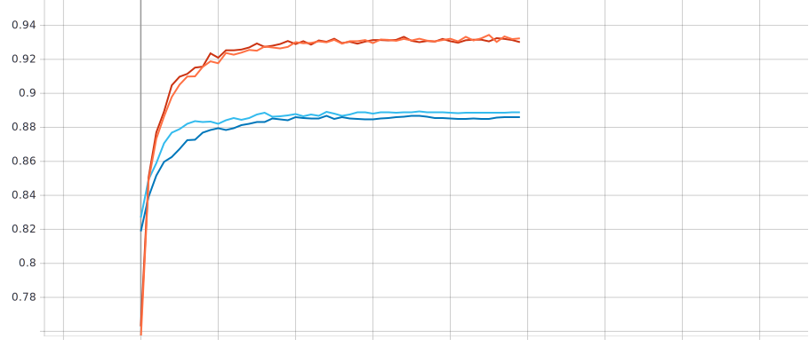
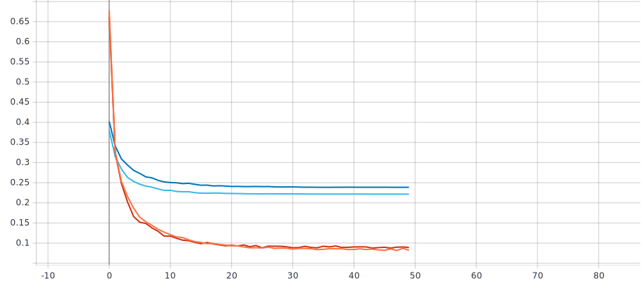

# Исследование влияния параметра “темп обучения” на процесс обучения нейронной сети на примере решения задачи классификации Oregon Wildlife с использованием техники обучения Transfer Learning  
***  
### Обучение нейронной сети EfficientNet-B0 (предварительно обученной на базе изображений imagenet) для решения задачи классификации изображений Oregon WildLife с использованием фиксированных темпов обучения 0.1, 0.01, 0.001, 0.0001
В данной лабораторной работе для решения задачи классификации изображений Oregon Wildlife использовалась нейронная сеть EfficientNet-B0, причем данная нейронная сеть будет иметь уже предобученные веса на базе изображений ImageNet (weights = "imagenet"). Также убирается классификатор данной нейронной сети с помощью параметра include_top=False, и создается собственный классификатор (один слой Flatten и полносвязный Dense слой). С помощью model.trainable = False мы замораживаем ту часть нейронной сети, которая отвечает за выделение каких-то характерных признаков в изображении, так как эта часть уже обучена:  
```
 inputs = tf.keras.Input(shape=(RESIZE_TO, RESIZE_TO, 3))  
  model = EfficientNetB0(include_top=False, input_tensor=inputs,pooling = 'avg', weights='imagenet')  
  model.trainable = False  
  model = tf.keras.layers.Flatten()(model.output)  
  outputs = tf.keras.layers.Dense(NUM_CLASSES, activation = tf.keras.activations.softmax)(model)  
  return tf.keras.Model(inputs=inputs, outputs=outputs)  
  ```
В процессе лабораторной работы изменялся темп обучения (0.1, 0.01, 0.001, 0.0001). Данное изменение позволит выявить более оптимальный темп обучения для решения задачи классификации изображений Oregon Wildlife, исходя из графиков метрики точности, графиков функции потерь и скорости обучения:
```
#optimizer=tf.optimizers.Adam(lr=0.1)
#optimizer=tf.optimizers.Adam(lr=0.01)
#optimizer=tf.optimizers.Adam(lr=0.001)
#optimizer=tf.optimizers.Adam(lr=0.0001)
```
### В результате обучения нейронной сети EfficientNet-B0 (предобученной) с разными темпами обучения (0.1 0.01 0.001 0.0001) получили следующие графики:    
* График метрики точности для предобученной нейронной сети EfficientNet-B0 с различными темпами обучения (0.1 0.01 0.001 0.0001):  

 



* График функции потерь для предобученной нейронной сети EfficientNet-B0 с различными темпами обучения (0.1 0.01 0.001 0.0001):  






* Анализ полученных результатов  
  + Исходя из полученных результатов можно отметить следующее: на тренировочном наборе данных лучшей метрики точности удалось добиться с темпом обучения равным 0.001, так как на протяжении всего обучения значения точности были выше, чем у остальных, и в конце обучения также наблюдается превосходство данного темпа обучения над остальными (точность около 94 процентов). Что же касается метрики точности валидационнго набора данных, то наблюдается следующее: с одной стороны лучший результат в конце обучения получился с использованием темпа обучения 0.1 (точность 88.5 процентов), но можно заметить, что при таком темпе обучения график получился "изрезанным", а это значит, что на протяжении всего обучения с каждой эпохой значения метрики точности сильно отличаются друг от друга и резко меняются. Похожая ситуация и с темпом равным 0.01. Поэтому можно отметить темпы обучения равные 0.0001 и 0.001, так как у них на протяжении всего обучения не наблюдается резкого изменения значения метрики точности, и в конце точность (для темпа 0.0001 точность 87.79 процентов, а для темпа 0.001 точность 88 процентов) получилось схожая с темпами обучения 0.01 (точность 87.69 процентов) и 0.1 (точность 88.5 процентов).  
  + Что касается функции потерь, то можно сказать, что лучший результат получился с темпами обучения равными 0.0001 и 0.001, так как на протяжении почти всего обучения потери были ниже чем у остальных на валидационном наборе данных и на тренировочном. Худшим же оказался темп обучения равный 0.1, так как с каждой эпохой на протяжении всего обучения величина ошибки возрастает на валидационном наборе данных, а на тренировочном наблюдаются значения потерь выше чем у других темпов обучения.  
  + Исходя из всего вышесказанного, можно отметить темпы обучения 0.001 и 0.0001 как самые оптимальные из всех использовавшихся. Точность у обоих этих темпов изменяется (возрастает) на протяжении всего обучения (50 эпох). Скорость сходимости 50 эпох у обоих. Скорость обучения у темпа 0.001 выше (12 минут 50 секунд), чем у темпа обучения 0.0001 (25 минут 29 секунд). Отличие почти в 2 раза. Самый оптимальный темп 0.001.
***  
## Реализация и применение в обучении следующих политик изменения темпа обучения: a. Пошаговое затухание (Step Decay) b. Экспоненциальное затухание (Exponential Decay)  
Политика пошагового затухания предполагает, что существует определенный начальный темп обучения и с наступлением определенного времени (эпохи) данный начальный темп будет уменьшаться в некоторое количество раз. Таким образом, темп обучения будет снижаться в несколько раз каждые несколько эпох.  
```
def step_decay(epoch,lr): # epoch - текущая эпоха  
  initial_lrate = 0.001 # начальный темп обучения  
  drop = 0.5 # во сколько раз будет изменяться тепм обучения (увеличиваться в 0.5 раз, т.е. уменьшаться в 2 раза)  
  epochs_drop = 5.0 # каждую пятую эпоху будет изменяться темп обучения  
  lrate = initial_lrate * math.pow(drop,math.floor((1+epoch)/epochs_drop))  
  return lrate  
```
Политика Экспоненциального затухания предполагает изменение начального темпа обучения в ```e``` в определенной степени раз каждые несколько эпох. Таким образом, темп обучения будет снижаться примерно в 2,7 в определенной степени раз каждую эпоху.    
```
def exp_decay(epoch,lr): # epoch - текущая эпоха  
  initial_lrate = 0.001 # начальный темп обучения  
  k = 0.11 # коэффициент в степени числа Эйлера  
  lrate = initial_lrate * math.exp(-k*epoch)  
  return lrate  
```
## Нахождение оптимальных параметров для экспоненциального затухания
Для нахождения оптимальных параметров экспоненциального затухания, были проведены обучения с различными параметрами, такими как (initial_lrate - начальный темп обучения, k - коэффициент наклона экспоненциальной кривой):  
+ initial_lrate = 0.1 и k = 0.1  
+ initial_lrate = 0.1 и k = 0.2  
+ initial_lrate = 0.1 и k = 0.3  
+ initial_lrate = 0.01 и k = 0.1  
+ initial_lrate = 0.01 и k = 0.2  
+ initial_lrate = 0.01 и k = 0.3  
+ initial_lrate = 0.001 и k = 0.1  
В результате получили следующие графики:  
* График метрики точности для предобученной нейронной сети EfficientNet-B0 (экспоненциальное затухание) для валидационного набора данных:   

  
 
  

* График функции потерь для предобученной нейронной сети EfficientNet-B0 (экспоненциальное затухание) для валидационного набора данных:    

  


   

   

Исходя из полученных результатов, в качестве оптимальных параметров для экспоненциального затухания можно выбрать initial_lrate = 0.1 и k = 0.3. Данная комбинация параметров позволяет добиться точности 89.2 процента, что больше чем у фиксированного темпа обучения 0.001 на 1.17 процента. Причем данная точность достигается уже на 27 эпохе и далее не меняется (как и потерь не становится больше или меньше). Но также можно выделить и комбинацию параметров initial_lrate = 0.01 и k = 0.3. При таких параметрах максимальная точность (89.17 процентов, что больше на 1.14 процента чем у фиксированного темпа обучения 0.001) достигается на 32 эпохе и далее не меняется, как и потери не возрастают и не уменьшаются. Поэтому, сравнивая данные комбинации, можно сделать выбор в сторону initial_lrate = 0.01 и k = 0.3. Хоть и скорость сходимости на 5 эпох меньше, но точность не сильно отличается (0.003 процента), а потерь меньше в разы (0.26 после 32 эпохи у initial_lrate = 0.01 и k = 0.3, а у initial_lrate = 0.1 и k = 0.3 значение потерь 1.537 после 27 эпохи).
***
## Нахождение оптимальных параметров для пошагового затухания  
Для нахождения оптимальных параметров пошагового затухания, были проведены обучения с различными параметрами, такими как (initial_lrate - начальный темп обучения, drop - во сколько раз будет изменяться тепм обучения, epochs_drop - эпоха на которой будет изменяться темп обучения):  
+ initial_lrate = 0.1, drop = 0.5, epochs_drop = 10.0  
+ initial_lrate = 0.1, drop = 0.5, epochs_drop = 5.0 
+ initial_lrate = 0.1, drop = 0.5, epochs_drop = 3.0  
+ initial_lrate = 0.01, drop = 0.5, epochs_drop = 10.0  
+ initial_lrate = 0.01, drop = 0.5, epochs_drop = 5.0
+ initial_lrate = 0.01, drop = 0.5, epochs_drop = 3.0 
+ initial_lrate = 0.001, drop = 0.5, epochs_drop = 5.0  
В результате получили следующие графики:  
* График метрики точности для предобученной нейронной сети EfficientNet-B0 (пошаговое затухание) для валидационного набора данных:  


* График функции потерь для предобученной нейронной сети EfficientNet-B0 (пошаговое затухание) для валидационнного набора данных:  

Исходя из полученных результатов, в качестве оптимальных параметров для пошагового затухания можно выбрать initial_lrate = 0.1 и k = 0.3. Данная комбинация параметров позволяет добиться точности 89.2 процента, что больше чем у фиксированного темпа обучения 0.001 на 1.17 процента. Причем данная точность достигается уже на 27 эпохе и далее не меняется (как и потерь не становится больше или меньше). Но также можно выделить и комбинацию параметров initial_lrate = 0.01 и k = 0.3. При таких параметрах максимальная точность (89.17 процентов, что больше на 1.14 процента чем у фиксированного темпа обучения 0.001) достигается на 32 эпохе и далее не меняется, как и потери не возрастают и не уменьшаются. Поэтому, сравнивая данные комбинации, можно сделать выбор в сторону initial_lrate = 0.01 и k = 0.3. Хоть и скорость сходимости на 5 эпох меньше, но точность не сильно отличается (0.003 процента), а потерь меньше в разы (0.26 после 32 эпохи у initial_lrate = 0.01 и k = 0.3, а у initial_lrate = 0.1 и k = 0.3 значение потерь 1.537 после 27 эпохи).
***
### В результате обучения нейронной сети EfficientNet-B0 (предобученной) с применением политик изменения темпа обучения (пошаговое затухание и экспоненциальное затухание) получили следующие графики (в сравнении с фиксированным темпом обучения 0.001):  
Использовавшиеся оптимальные параметры:
+ Пошаговое затухание ( )  
+ Экспоненциальное затухание (initial_lrate = 0.01 и k = 0.3)  
+ Фиксированный темп (0.001)  
 
* График метрики точности для предобученной нейронной сети EfficientNet-B0 (пошаговое затухание, экспоненциальное затухание, фиксированный темп 0.001):  
 
  

  

* График функции потерь для предобученной нейронной сети EfficientNet-B0 (пошаговое затухание, экспоненциальное затухание, фиксированный темп 0.001):  

  

  

* Анализ полученных результатов  
Исходя из полученных результатов можно отметить следующее:  
  + Применение политик изменения темпа обучения (пошаговое затухание и экспоненциальное затухание) позволило улучшить обучение нейронной сети на валидационном наборе данных, а именно:  
    1. Увеличилась скорость схождения алгоритма, по сравнению с фиксированным темпом 0.001 (увеличение скорости на 18 эпох у экспоненциальное затухание, увеличение скорости на эпох у пошагового затухания)  
    2. Увеличение точности в конце обучения, по сравнению с фиксированным темпом 0.001 (увеличение точности на 1.14 процента у экспоненциальное затухание, увеличение точности на процента у пошагового затухания)  
    3. Уменьшение значения потерь в конце обучения, по сравнению с фиксированным темпом 0.001 (уменьшение значения потерь на 0.1038 у экспоненциального затухания, уменьшение значения потерь на  у пошагового затухания)  
  + Таким образом, использование политик изменения темпа обучения Step Decay или Exponential Decay привело к улучшению сходимости алгоритма обучения и по скорости, и по точности, и по значению потерь при оптимально подобранных параметрах, в сравнении с оптимально выбранным фиксированным темпом обучения.  
  + Сравнивая же политики пошагового затухания и экспоненциального затухания, лучшего результата удалось добится с помощью  (точность выше на процента, скорость схождения алгоритма больше на эпох, потерь меньше на )
 
