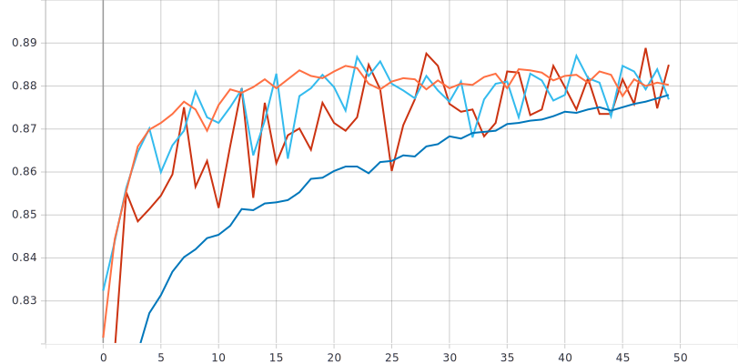
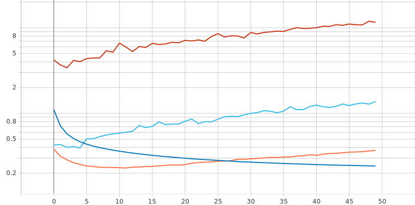
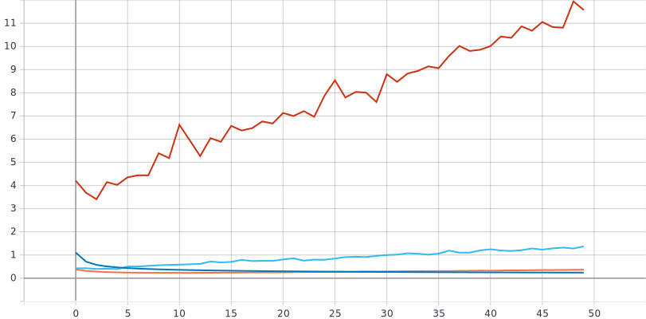

# Исследование влияние параметра “темп обучения” на процесс обучения нейронной сети на примере решения задачи классификации Oregon Wildlife с использованием техники обучения Transfer Learning  
Вданной лабораторной работе для решения задачи классификации изображений Oregon Wildlife использовалась нейронная сеть EfficientNet-B0, причем данная будет иметь уже предобученные веса на базе изображений ImageNet. Для того, чтобы наши веса были предобученными на базе изображений ImageNet, необходимо параметр weights выставить равным "imagenet". Также убирается классификатор данной нейронной сети с помощью параметра include_top=False, и создается собственный классификатор (один слой Flatten и полносвязный Dense слой). С помощью model.trainable = False мы замораживаем ту часть нейронной сети которая отвечает за выделение каких-то характерных признаков в изображении так как эта часть уже обучена:  
```
 inputs = tf.keras.Input(shape=(RESIZE_TO, RESIZE_TO, 3))  
  model = EfficientNetB0(include_top=False, input_tensor=inputs,pooling = 'avg', weights='imagenet')  
  model.trainable = False  
  model = tf.keras.layers.Flatten()(model.output)  
  outputs = tf.keras.layers.Dense(NUM_CLASSES, activation = tf.keras.activations.softmax)(model)  
  return tf.keras.Model(inputs=inputs, outputs=outputs)  
  ```
В процессе лабораторной работы изменялся темп обучения от 0.1 до 0.0001. Данное изменеие позволит выявить более оптимальный темп обучения для решения задачи классификации изображений Oregon Wildlife исходя из графиков метрики точности, графиков функции потерь и скорости обучения:
```
#optimizer=tf.optimizers.Adam(lr=0.1)
#optimizer=tf.optimizers.Adam(lr=0.01)
#optimizer=tf.optimizers.Adam(lr=0.001)
#optimizer=tf.optimizers.Adam(lr=0.0001)
```
### В результате обучения нейронной сети EfficientNet-B0 (предобученной) с разными темпами обучения (0.1 0.01 0.001 0.0001) получили следующие графики:  
Синяя линия - на валидации  
Оранжевая линия - на обучении  
* График метрики точности для предобученной нейронной сети EfficientNet-B0 с различными темпами обучения (0.1 0.01 0.001 0.0001): 
 



* График функции потерь для предобученной нейронной сети EfficientNet-B0 с различными темпами обучения (0.1 0.01 0.001 0.0001):  






* Анализ полученных результатов  
Исходя из полученыых результатов можно отметить следующее: 

### В результате обучения нейронной сети EfficientNet-B0 (предобученной) с разными темпами обучения (0.1 0.01 0.001 0.0001) получили следующие графики:  
Синяя линия - на валидации  
Оранжевая линия - на обучении  
* График метрики точности для нейронной сети EfficientNet-B0 (случайное начальное приближение):  


* График функции потерь для нейронной сети EfficientNet-B0 (случайное начальное приближение):  


* Анализ полученных результатов  


